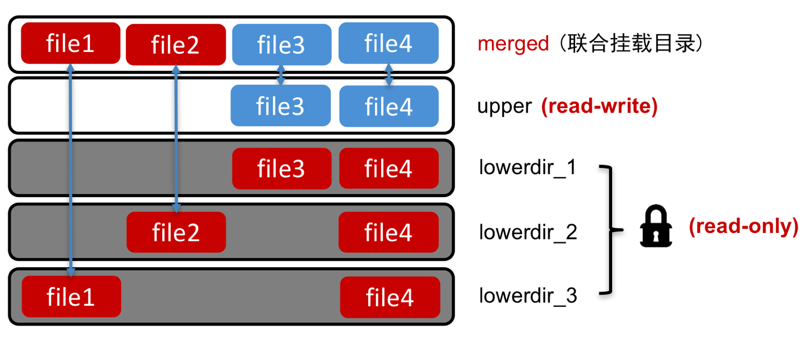

# OverlayFS 简介

> OverlayFS 会把一个“上层”的目录和“下层”的目录组合在一起：“上层”目录和“下层”目录或组合，或覆盖，或一块呈现。另外“下层”目录也可以是联合文件系统的挂载点。


## Overlay vs Overlay2

目前，Overlay2 是 Docker 默认及推荐的存储驱动类型，两者的区别也仅仅只是下层目录之间共享数据的方法不同：

- Overlay 仅有2层，即多层目录不会被实现为多个 OverlayFS 层。为了实现“两个目录反映多层目录“而通过硬连接索引与底层共享的数据，节省了空间。
- Overlay2 天生支持多层，通过每层的 `lowerdir` 目录与底层共享数据。

因此，Overlay2 能提供更好的性能，消耗的索引节点（inode）更少。

> **⚠️ 一个我陷入的严重误区 ⚠️**：我在今天再次仔细审阅这份笔记之前，一直认为 Overlay 和 Overlay2 是两种文件系统，只是 Overlay2 是 Overlay 的升级。我还困惑：为什么两者的文件系统标识似乎没有任何区分，都是 `overlay` ？我之前就检索了 Linux Kernel 官网文档[文件系统部分](https://www.kernel.org/doc/Documentation/filesystems)也没找到 Overlay2，而仅有 OverlayFS。然后我终于猜测 Overlay/Overlay2 是 Docker 对 OverlayFS 的两种应用，但不敢下结论，于是又看了看 Docker 官方文档的说明，终于发现了这样一句话：
>
> ```
> Docker provides two storage drivers for OverlayFS: the original overlay, and the newer and more stable overlay2.
> ```
> 原来 Overlay/Overlay2 只是 Docker 基于 OverlayFS 实现的两种存储驱动类型！怪我之前没有仔细品味每一句话的含义，好在我还是产生了疑问。现在，我可以明确地说，下面的实验是针对原始的 OverlayFS 的操作。

## 确认系统是否支持 OverlayFS

```bash
$ grep overlay /proc/filesystems
nodev   overlay
```

## OverlayFS 挂载命令

```bash
$ mount -t overlay overlay -olowerdir=lower,upperdir=upper,workdir=work merged
```

- `-o` 多个参数间不可以有任何空格。
- `workdir` 必须是一个与 `upperdir` 相同文件系统的空文件夹。
- `merged` 联合挂载点所在的目录。
- `lowerdir` 可以指定多个文件夹，用 `:` 隔开，从从左往右级别依次降低。
- `upperdir`、`workdir` 参数可以省略，表示只读。



## 挂载实验

1. 创建实验所需文件及文件夹

```bash
$ mkdir overlay && cd overlay && mkdir lower upper work merged && echo lower > lower/layer && echo lower > lower/lower && echo upper > upper/layer && echo upper > upper/upper
$ tree
.
├── lower
│   ├── layer
│   └── lower
├── merged
├── upper
│   ├── layer
│   └── upper
└── work
```

2. 读写模式联合挂载

```bash
$ mount -t overlay overlay -olowerdir=lower,upperdir=upper,workdir=work merged
$ tree
.
├── lower
│   ├── layer
│   └── lower
├── merged
│   ├── layer
│   ├── lower
│   └── upper
├── upper
│   ├── layer
│   └── upper
└── work
    └── work

# 上层文件覆盖下层文件
$ cat merged/layer 
upper
```

3. 新增文件

```bash
$ echo "feat feat feat" > merged/feat
$ tree
.
├── lower
│   ├── layer
│   └── lower
├── merged
│   ├── feat
│   ├── layer
│   ├── lower
│   └── upper
├── upper
│   ├── feat
│   ├── layer
│   └── upper
└── work
    └── work

# 发现新增文件出现在了 upper 目录中
```

4. 删除文件

```bash
$ rm merged/lower
$ ls -l */lower
-rw-r--r-- 1 root root    6 Dec 18 12:14 lower/lower
c--------- 1 root root 0, 0 Dec 18 12:15 upper/lower

$ rm merged/upper
```

- 删除 `lowerdir` 中的文件或目录时，会在 `upperdir` 建立一个同名的主次设备号都为 0 的字符设备，但并没有直接删掉文件。
- 删除 `upperdir` 中的文件或目录时，那就是直接删掉文件。

### 章节导航

- 上一节：[AUFS 简介](AUFS.md)
- 下一节：[浅析 RUN 执行过程](../../命令/run.md)
