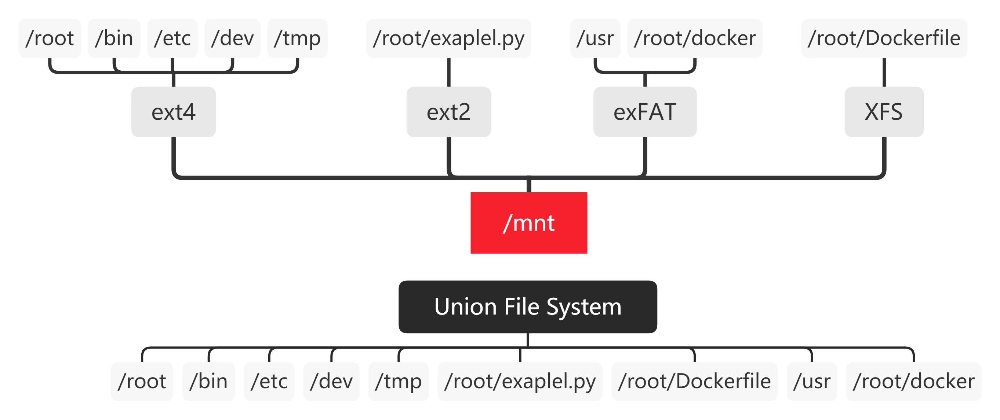

# 联合文件系统（Union File System）概述

**Union File System**，简称 Union FS，是一种把其他文件系统联合到一个挂载点的文件系统服务，简而言之就是把多个目录（可能对应不同的文件系统）挂载到同一个目录，对外呈现这些目录的联合。

Union FS 不是一种底层文件系统，无法独立于其他文件系统而存在。它用分支把不同文件系统的文件和目录“透明地”覆盖，形成单个一致的文件系统。这些分支或者是只读的，或者是可读写的，当对这个虚拟后的联合文件系统进行写操作的时候，系统是真正写到了一个新的文件中。这个虚拟后的联合文件系统是可以对任何文件进行操作的，但是其实它并没有改变原来的文件，而是用了写时复制技术。

**写时复制**（Copy-on-Write），也叫隐式共享，是一种对可修改资源实现高效复制的资源管理技术。它的思想是，如果一个资源是重复的，那么这个资源可以被多个实例共享，而不需要立即创建一个新的资源副本。创建新资源发生在第一次写操作时，也就是对资源进行修改的时候。通过这种资源共享的方式，可以显著地减少未修改资源复制带来的消耗，但是也会在进行资源修改时增加小部分的开销。

### 章节导航

- 上一节：[自制一个限制内存的容器](../控制组/自制一个限制内存的容器.md)
- 下一节：[AUFS 简介](AUFS.md)
